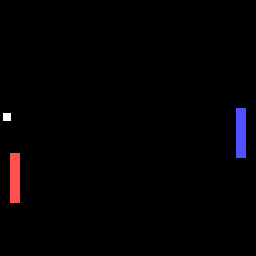

# Dueling Pong Bots

Pong AI's trained with various reinforcement learning methods compete each other in a multiagent framework 
that allows RL Agent vs RL Agent, Human vs RL Agent, and Human vs Hardcoded AI interactions

RL Algorithms implemented: Advantage-Actor-Critic (A2C), Vanilla Policy Gradient (VPG)

Model Types: Convolutional networks, Feedforward networks

----------------------------------------------------
# Results

Running VPG (Red) vs ActorCritic (Blue) after training for 100 epochs with rewards for scoring and hitting the ball:

Tensorboard VPG(Green) vs ActorCritic(Gray):

When the reward for hitting the ball is removed, the agents learn to score against each other.

The agents now play a zero sum game as seen in the rewards graph:
